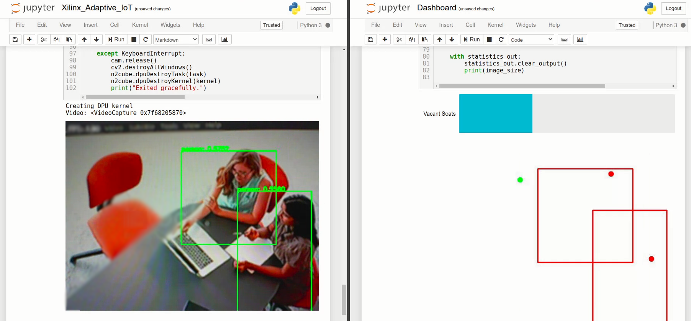

# Xilinx Smart Office Hot Desking

## Description

This repo contains the source codes for my entry in the [Adaptive Computing Developer Contest with Xilinx](https://www.hackster.io/contests/xilinxadaptivecomputing) on Hackster.io

## Instructions

Please [see my submission](https://www.hackster.io/zst123/smart-office-hot-desking-with-pynq-vitis-ai-8ac98d) for setup instructions. It will go through the setup of of Edge hardware, and compilation on the host.

Run YoloV3-Application.ipynb first to have a stable webcam feed, and then run Dashboard.ipynb to set up the dashboard interface.

## Screenshots

